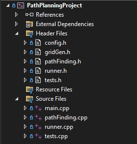
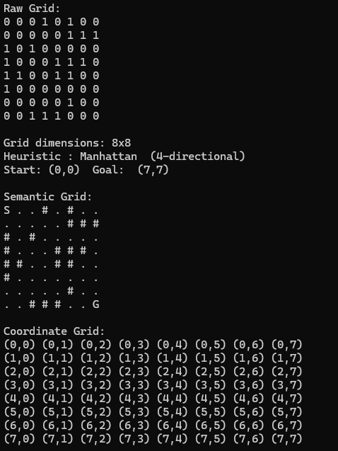
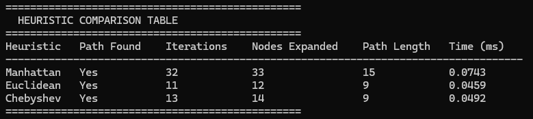
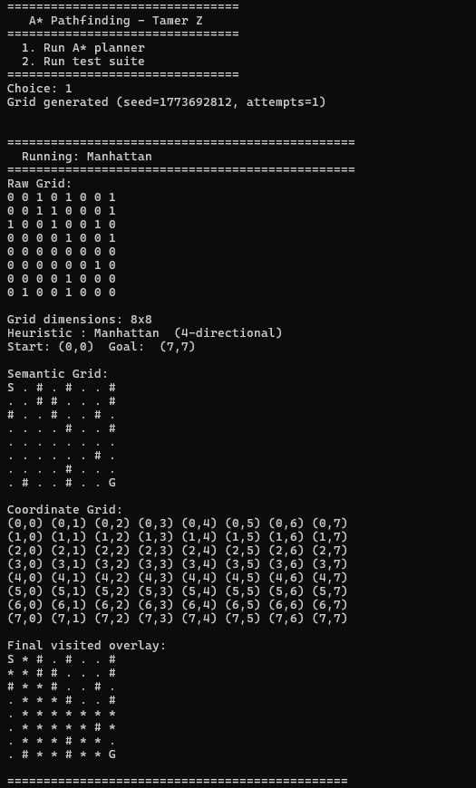
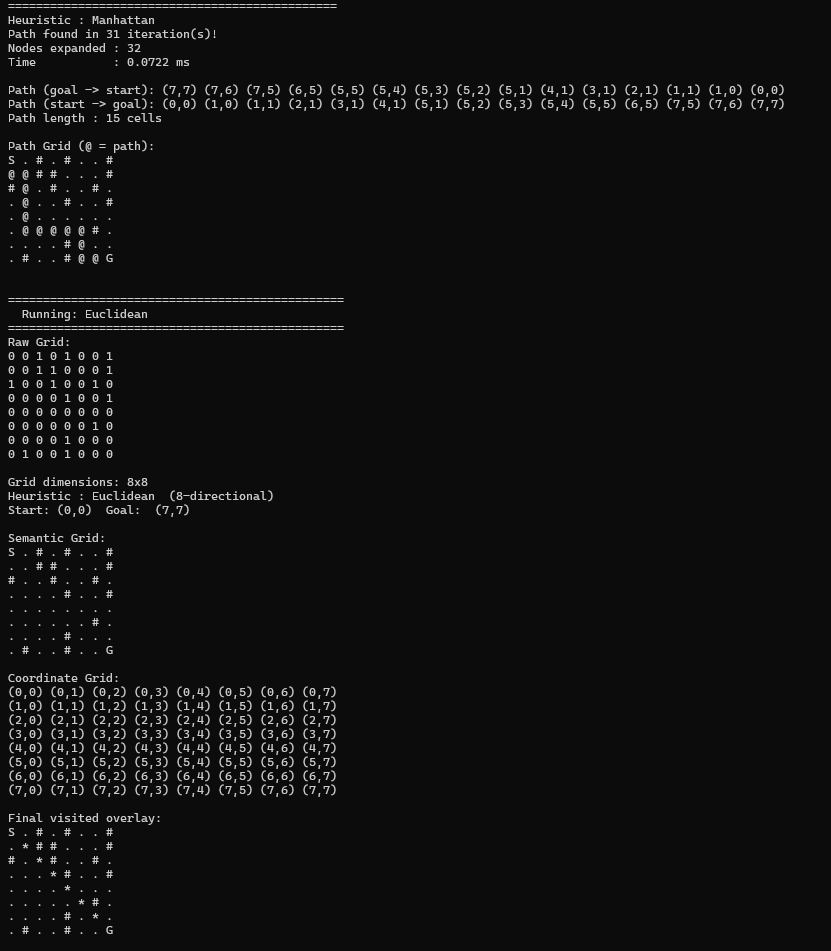
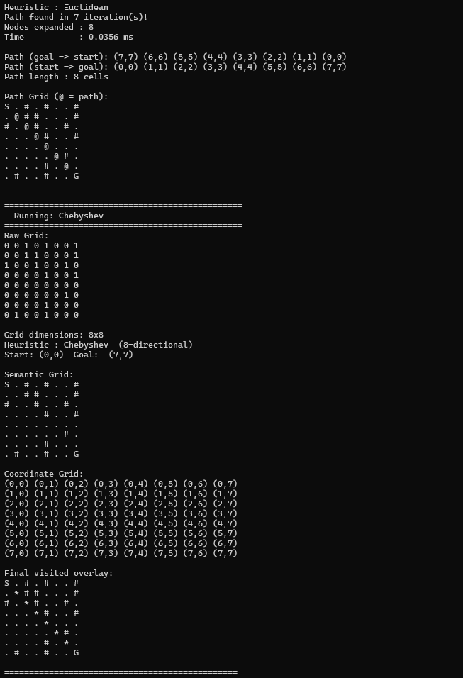
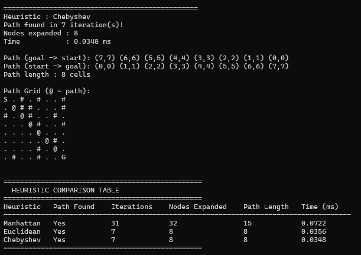

# A* Pathfinding in C++
 
**Tamer Zraiq | G00425053 | 4th Year 2026**
 
| | |
|---|---|
| **Language** | C++17 |
| **Files** | `config.h` · `gridGen.h` · `pathFinding.h` · `pathFinding.cpp` · `runner.cpp` · `tests.h` · `tests.cpp`· `main.cpp` |
 
---
 
## Table of Contents
 
1. [Project Overview](#1-project-overview)
2. [The A* Algorithm](#2-the-a-algorithm)
3. [AI Tools Declaration](#3-ai-tools-declaration)
4. [Development History](#4-development-history)
5. [Code Walkthrough](#5-code-walkthrough)
   - [config.h](#51-configh)
   - [gridGen.h](#52-gridgenh)
   - [pathFinding.h](#53-pathfindingh)
   - [pathFinding.cpp](#54-pathfindingcpp)
   - [runner.h and runner.cpp](#55-runnerh-and-runnercpp)
   - [main.cpp](#56-maincpp)
6. [Heuristic Functions](#6-heuristic-functions)
7. [Architecture and Design Choices](#7-architecture-and-design-choices)
8. [Testing](#8-testing)
9. [C-Style Code: What the AI Got Wrong](#9-c-style-code-what-the-ai-got-wrong)
10. [Terminal Results](#10-terminal-results)
11. [Limitations and Improvements](#11-limitations-and-improvements)
12. [Problems Encountered](#12-problems-encountered)
13. [Reflection](#13-reflection)
14. [References](#14-references)


## 1. Project Overview
 
This project implements the A* search algorithm in C++ for 2D grid-based pathfinding in Visual Studio 2022 IDE. The program finds the shortest path between a start cell and a goal cell on a grid that may contain obstacles. It supports three heuristic functions, random grid generation with a built-in solvability check, and a comparison mode that runs all three heuristics on the same grid and prints a results table.

The implementation follows the A* structure from GeeksforGeeks [4] and builds on it with a full C++ class-based design. The PathPlanning class handles the entire search pipeline internally: open and closed list management, successor generation, cost computation, and path reconstruction. Outside the class, config.h controls all runtime parameters, so the grid size, start and goal positions, heuristic choice, and output verbosity can all be changed in one place without touching the algorithm code. The project was developed in four stages: getting a correct single-file implementation, splitting it into a modular multi-file structure, adding the config system and the three heuristics, and finally, a code review pass. Each stage is covered in Section 4.

### How to Run

**The Structure:**




After setting up the project structure and hierarchy, compile the files and run them using the Start Without Debugging button. 

On startup, the program presents a menu:
 
```
================================
   A* Pathfinding - Tamer Z
================================
  1. Run A* planner
  2. Run test suite
================================
Choice:
``` 
**Option 1** runs the planner. What happens next depends on `config.h`:
- If `RANDOMISE_GRID = true`, a random grid is generated and the seed is printed so the layout can be reproduced
- If `COMPARE_HEURISTICS = true`, all three heuristics run on the same grid, and a comparison table is printed at the end
- If `COMPARE_HEURISTICS = false`, only the heuristic set in `ACTIVE_HEURISTIC` runs
- If `SHOW_ITERATION_TRACE = true`, the open list, selected node, and visited overlay are printed after every iteration
 
**Option 2** runs the full test suite of seven cases.
 
### Configuring a Run
 
All modifiable parameters are in `config.h`.
 
| Parameter | What it controls |
|---|---|
| `GRID_ROWS` / `GRID_COLS` | Grid dimensions |
| `START_ROW` / `START_COL` | Start position |
| `GOAL_ROW` / `GOAL_COL` | Goal position |
| `RANDOMISE_GRID` | Random grid or fixed default |
| `OBSTACLE_DENSITY` | Fraction of cells that become obstacles (0.0 to ~0.45) |
| `RANDOM_SEED_AUTO` | New layout every run, or fixed seed |
| `RANDOM_SEED` | Specific seed when auto is off |
| `COMPARE_HEURISTICS` | Run all three or just one |
| `ACTIVE_HEURISTIC` | Which heuristic when not comparing (`"MANHATTAN"`, `"EUCLIDEAN"`, `"CHEBYSHEV"`) |
| `SHOW_ITERATION_TRACE` | Full per-iteration output or final result only |
 
### Expected Output
 
On a successful run with `COMPARE_HEURISTICS = true` and `SHOW_ITERATION_TRACE = false`, you will see the startup grids printed once, then each heuristic's final result, then the comparison table. Screenshots of the expected terminal output are shown below.
 
  

---
 
## 2. The A* Algorithm
A* is a graph traversal and pathfinding algorithm \[1\] \[4\]. It works by combining the actual cost of reaching a node with an estimated cost to the goal, using that combined value to decide which node to explore next. This makes it significantly more directed than Dijkstra's algorithm, which has no awareness of where the goal is and expands nodes in all directions equally.
 
### f(n) = g(n) + h(n)
 
Every node in the search is scored using this formula \[4\]:
 
- **g(n)** is the exact cost of the path from the start node to node n, accumulated as the search progresses
- **h(n)** is the heuristic estimate of the cost from n to the goal. This is never exact, but it must never over-estimate the true cost (a property called **admissibility**) \[1\] \[2\]. If h over-estimates, A* may discard the actual shortest path and return a suboptimal result
- **f(n)** is the sum of the two. The algorithm always expands the node with the lowest f next, which is what directs the search toward the goal rather than outward in all directions
 
### The open and closed lists
 
A* maintains two lists throughout the search \[4\]:
 
- **Open list**: nodes that have been discovered and scored but not yet expanded
- **Closed list**: nodes that have already been expanded and do not need to be revisited
 
### How the search runs
 
This is the structure the implementation follows, based on the GeeksforGeeks breakdown \[4\]:
 
```
1. Initialise the open list
2. Initialise the closed list
   Put the start node on the open list (f can be left as zero)
 
3. While the open list is not empty:
 
   a) Find the node with the lowest f on the open list — call it q
   b) Pop q off the open list
 
   c) Generate q's successors and set their parent to q
 
   d) For each successor:
      i)  If the successor is the goal — stop, path found
 
      ii) Otherwise compute g, h, and f:
            successor.g = q.g + distance from q to successor
            successor.h = heuristic distance from successor to goal
            successor.f = successor.g + successor.h
 
      iii) If a node with the same position exists in the OPEN list
           with a lower f — skip this successor
 
      iv)  If a node with the same position exists in the CLOSED list
           with a lower f — skip this successor
           Otherwise add the successor to the open list
 
   e) Push q onto the closed list
 
If the open list empties without finding the goal, no path exists
```
 
### Parent pointers and path recovery
 
Each node stores the coordinates of the node where it reached from (the previous node) \[4\]. When the goal is found, the path is recovered by following these parent references backwards from the goal to the start, then reversing the sequence. In this implementation, that chain is stored in the `pr` and `pc` fields of `SimpleNode`, with `-1, -1` used as the sentinel value to mark the start node.

---
## 3. AI Tools Declaration
 
AI tools were used throughout this project for several supporting tasks. Claude was used to help structure code across multiple files, add comments to functions, suggest fixes for bugs that were found throughout implementation, and clear up the feasibility of certain options. The algorithm logic, design decisions, heuristic matching, and the critical analysis in Section 9 were developed through my own understanding and review of the generated code.
 
AI was not used to simply generate and submit code. Each piece of generated code was reviewed, tested, broken, and fixed. A number of structural bugs in the initial output had to be identified and corrected before the algorithm produced correct results, and several C-style patterns were identified and documented as examples of what the AI did not handle well from a C++17 standpoint.

---

## 4. Development History

The project went through four clear stages. Each one was built on a working version of the previous, which made it possible to test and verify changes without breaking everything.

### Stage 1: Getting a Working Algorithm

The first version was a single file built by following the GeeksforGeeks A* structure \[4\] directly. The core loop, open and closed lists, successor generation, and path reconstruction were all implemented from that reference. During testing, several bugs showed up that needed to be found and fixed; that's where AI tools came in.

The most significant was an outer `for (k < 4)` loop wrapped around the entire search. This caused A* to run four times from scratch on every execution. The output looked plausible at first because the path was found eventually, but the algorithm was restarting completely on each outer iteration.

```cpp
// Bug: outer loop that should not exist
for (int k = 0; k < 4; ++k) {
    while (!openList.empty()) {
        // entire search ran inside here
    }
}

// Fix: single while loop
while (!openList.empty()) {
    // ...
}
```

Another issue was that when the goal was found during successor expansion, nothing signalled the main loop to stop. The search kept going after the goal was already reached. So a `goalFound` flag and a break were added to fix this.

The start node also had its `f` value hardcoded to 0, meaning the heuristic did not affect the first step. This was corrected to compute `h` properly and set `f = g + h`.

Path reconstruction used a `goto` label, which was cleaned up to a proper return statement.

---

### Stage 2: Splitting into Files and Adding Structure

Once the algorithm was correct, the single file was split into eight files, each with one clear job. This made every later change faster and safer.

The key change here was making `AStar_Planner()` return a `PlannerResult` struct instead of being void. Before this, the only way to inspect the result was to read the terminal output. With the struct, test cases and the comparison runner could check outcomes directly without parsing printed text.

A `verbose` flag was added so the per-iteration trace could be turned off. Without it, the comparison mode would produce hundreds of lines per run, burying the comparison table.

Timing was added using `std::chrono::high_resolution_clock` so `PlannerResult.timeMs` reflects the actual measured time.

Seven test cases were written at this stage, covering normal paths, no path situations, start equal to goal, start or goal on an obstacle, a minimal 2x2 grid, and a narrow corridor.

---

### Stage 3: Config File, Random Grids, and Three Heuristics

At this point, all hardcoded values were moved into `config.h` as `constexpr` values. Grid size, start position, goal position, obstacle density and all behaviour flags live there.

Random grid generation was added in `gridGen.h`. After placing obstacles randomly, it runs a BFS (Breadth-First Search) flood-fill from start to goal to confirm the grid is solvable before returning it. If not, it adjusts the seed and tries again.

Euclidean and Chebyshev heuristics were added alongside Manhattan. The important discovery here was that Manhattan must be restricted to 4-directional movement. Using Manhattan with 8-directional movement makes it inadmissible because it over-estimates diagonal moves \[2\] \[3\]. Chebyshev is the correct heuristic for 8-directional movement, and Euclidean also works well with it.

At the same time, `h` and `f` in `SimpleNode` were changed from `int` to `double`. When Euclidean was first added with `int` storage, the `sqrt` result was being shortened, which made Euclidean behave almost the same as Manhattan and made the comparison pointless.

---

### Stage 4: Full Code Review and Final State

With all three heuristics implemented and the configuration system in place, the focus shifted to reviewing the codebase for correctness and overall quality.

The C++ audit highlighted a few areas that needed improvement. Direction offsets were implemented using raw int* arrays instead of std::array, random number generation relied on std::rand/std::srand rather than std::mt19937, string literals were handled with const char* instead of std::string_view, and the closed list was being searched with a linear O(n) scan for every neighbour check. These issues and their modern alternatives are discussed in Section 9.

From an algorithmic perspective, the review confirmed that the implementation behaves correctly end-to-end. The handling of stale duplicates in the open list was verified, nodes can appear multiple times if their cost is updated after insertion, and the closed list check before expansion correctly filters out outdated entries. The use of double for the h and f costs was also validated, as Euclidean distance requires fractional precision. In addition, the movement model was cross-checked against each heuristic to ensure consistency, particularly that the Manhattan distance is restricted to non-diagonal motion.

At this stage, the project consists of eight files, with config.h centralising all parameters. The system supports random grid generation with BFS-based solvability checks, three heuristics aligned with their respective movement models, and a comparison table reporting iteration count, nodes expanded, path length, and execution time. Seven test cases are included, and the main entry point has been reduced to a concise 30-line main.cpp. The introduction of the PlannerResult return type also allows results to be inspected programmatically, rather than relying on terminal output.

---

## 5. Code Walkthrough

### 5.1 `config.h`
 
The decision to have a dedicated config file came from a practical problem: changing the grid size or start position meant hunting through multiple files to find hardcoded values. Putting everything in one place as `constexpr` means one file controls the entire program's behaviour without touching any algorithm code.
 
`constexpr` was chosen over `#define` for all numeric and boolean values because `#define` is a text substitution with no type information. The compiler cannot catch a `#define` being passed where the wrong type is expected. `constexpr` values are type-checked, scoped, and visible in the debugger \[6\] \[7\].
 
```cpp
constexpr int    GRID_ROWS        = 8;
constexpr int    GRID_COLS        = 8;
constexpr int    START_ROW        = 0;
constexpr int    GOAL_ROW         = 7;
constexpr bool   RANDOMISE_GRID   = true;
constexpr double OBSTACLE_DENSITY = 0.28;
```
 
`ACTIVE_HEURISTIC` was originally a `#define` string, inconsistent with everything else in the file. It was changed to `constexpr std::string_view` \[6\] so it follows the same pattern as every other parameter and can be compared with `==` directly without copying into a `std::string` first.
 
```cpp
// Before — no type, no scope, unsafe to compare directly
#define ACTIVE_HEURISTIC "MANHATTAN"
 
// After — consistent with everything else in config.h
constexpr std::string_view ACTIVE_HEURISTIC = "MANHATTAN";
```
 
The split between `RANDOM_SEED_AUTO` and `RANDOM_SEED` was a deliberate choice. During testing it was useful to fix a specific layout and run the same grid repeatedly to verify behaviour. But for the comparison mode, a new grid every run is more representative. Having both options controlled from config without touching any other file made switching between them fast.
 
```cpp
constexpr bool         RANDOM_SEED_AUTO = true;
constexpr unsigned int RANDOM_SEED      = 42;
```
 
`SHOW_ITERATION_TRACE` exists because verbose output is essential for understanding what the algorithm is doing on small grids, but it completely buries the comparison table on anything larger. Making it a config flag rather than hardcoded meant no code changes were needed to switch between the two modes.
 
```cpp
constexpr bool SHOW_ITERATION_TRACE = false;
```
 
---
 
### 5.2 `gridGen.h`
 
The two functions here, `isSolvable` and `generateGrid`, are both `static` free functions rather than class methods. The decision was intentional: grid generation has nothing to do with pathfinding. Putting it in the `PathPlanning` class would mix concerns that are independent of each other. A separate file that the rest of the program can include without pulling in the whole planner keeps responsibilities clean.
 
BFS was chosen for the solvability check rather than running A* itself because BFS does not need any cost or heuristic setup , it just checks reachability. Running A* to check solvability would require configuring a full planner object, which is more setup than the check deserves. BFS is also guaranteed to terminate in O(rows x cols) time regardless of the grid layout.
 
```cpp
static bool isSolvable(const std::vector<std::vector<int>>& grid,
                        int sr, int sc, int gr, int gc)
```
 
The `do-while` loop for generation was chosen over a `while` loop because the check requires a generated grid to exist before it can run. A `while` loop would either require duplicating the generation code before the loop or initialising the grid to a dummy failing state. The `do-while` runs the body once unconditionally then checks, which matches the actual requirement without any artificial setup.
 
```cpp
do {
    ++attempts;
    grid.assign(rows, std::vector<int>(cols, 0));
    // ... place obstacles ...
    if (!isSolvable(grid, sr, sc, gr, gc))
        rng.seed(seed + attempts * 7);
} while (!isSolvable(grid, sr, sc, gr, gc));
```
 
`std::mt19937` with `std::uniform_real_distribution` was used instead of `std::rand` \[6\] because `std::rand` has poor statistical distribution and its global state makes it unsafe in any multi-threaded context. The Mersenne Twister produces a much better distribution and the seed is encapsulated in the engine object, not global state.
 
```cpp
// Before
std::srand(seed);
double roll = static_cast<double>(std::rand()) / RAND_MAX;
 
// After
std::mt19937 rng(seed);
std::uniform_real_distribution<double> dist(0.0, 1.0);
double roll = dist(rng);
```
 
The seed is passed out by reference so the caller can print it. This was added after a specific grid layout exposed a bug and there was no way to reproduce it. Having the seed available means any run can be reproduced exactly by setting `RANDOM_SEED_AUTO = false` and using the printed seed value.
 
```cpp
static std::vector<std::vector<int>> generateGrid(unsigned int& outSeed)
```
 
---
 
### 5.3 `pathFinding.h`
 
#### Why a scoped enum for `Heuristic`
 
`enum class` was used instead of a plain `enum` because the three heuristic names are common words. A plain `enum` would put `MANHATTAN`, `EUCLIDEAN`, and `CHEBYSHEV` directly into the enclosing scope, which risks name collisions with anything else in the program that uses those names. With `enum class`, they must be referenced as `Heuristic::MANHATTAN`, making every usage explicit \[6\] \[7\].
 
```cpp
enum class Heuristic {
    MANHATTAN,
    EUCLIDEAN,
    CHEBYSHEV
};
```
 
#### Why `PlannerResult` as a return type
 
The original implementation had `AStar_Planner()` return void. The only way to verify what happened was to read the terminal output. This made writing test cases nearly impossible, there was no way to check programmatically whether a path was found or how many nodes were expanded. Switching to a return struct meant the comparison runner could collect three results, inspect the numbers, and format the table without parsing any printed output. Every field has a default value so an early return due to invalid inputs gives the caller a properly zeroed result rather than undefined values.
 
```cpp
struct PlannerResult {
    bool   pathFound     = false;
    int    iterations    = 0;
    int    nodesExpanded = 0;
    int    pathLength    = 0;
    double timeMs        = 0.0;
    std::vector<std::pair<int,int>> path;
};
```
 
#### Why `g`, `h`, and `f` are all `double` in `SimpleNode`
 
`g` started as `int` because all moves originally cost 1. When diagonal moves were given a cost of 1.414 to reflect their true geometric distance, the accumulated cost became fractional and `int` would silently truncate it, making the path cost wrong. `h` and `f` were already `double` because Euclidean distance uses `std::sqrt` which returns `double`, keeping them `int` was causing Euclidean to behave like a rounded-down approximation of Manhattan, which made the comparison table meaningless. Making all three `double` was the consistent fix.
 
```cpp
struct SimpleNode {
    int    r, c;
    double g;       // double: diagonal moves cost 1.414, not 1
    double h, f;    // double: Euclidean uses sqrt, fractional result
    int    pr, pc;
};
```
 
#### Why `g_cost` checks both row and column
 
A diagonal move changes both row and column simultaneously, which is the only way to distinguish it from a straight move. The cost 1.414 is the approximation of sqrt(2), the true Euclidean distance of a unit diagonal step. Without this, every move costs the same regardless of direction, which makes Euclidean and Chebyshev paths look artificially cheap compared to Manhattan paths and distorts the comparison.
 
```cpp
double g_cost(int r1, int c1, int r2, int c2) const {
    return (r1 != r2 && c1 != c2) ? 1.414 : 1.0;
}
```
 
#### Why `h_cost` stores `dr` and `dc` as `double` before the switch
 
`std::abs` on integer arguments returns an integer. If `dr` and `dc` were computed as `int`, then Euclidean's `dr*dr + dc*dc` would be integer arithmetic before being passed to `std::sqrt`, and Chebyshev's `std::max(dr, dc)` would also return an integer. Storing them as `double` from the start means all three formulas produce the correct type without any hidden truncation.
 
```cpp
double h_cost(int row, int col, int gr, int gc) const
{
    double dr = std::abs(row - gr);  // stored as double immediately
    double dc = std::abs(col - gc);
    switch (heuristic) {
        case Heuristic::EUCLIDEAN:  return std::sqrt(dr*dr + dc*dc);
        case Heuristic::CHEBYSHEV:  return std::max(dr, dc);
        case Heuristic::MANHATTAN:
        default:                    return dr + dc;
    }
}
```
 
---
 
### 5.4 `pathFinding.cpp`
 
#### Why display functions are static free functions, not class methods
 
The five print functions have no need for class state, they take everything they need as parameters. Making them class methods would give them access to the entire private interface of `PathPlanning` for no reason. Declaring them `static` at file scope means they are invisible outside `pathFinding.cpp`, which prevents them from polluting the global namespace and makes it clear they are implementation details, not part of the public interface.
 
```cpp
static void printRawGrid(const std::vector<std::vector<int>>& grid)
static void printSemanticGrid(const std::vector<std::vector<int>>& grid, int sr, int sc, int gr, int gc)
static void printCoordinateGrid(int rows, int cols)
static void printVisitedGrid(...)
static void printPathGrid(...)
```
 
#### Why `printPathGrid` builds a 2D boolean grid
 
Marking path cells in a 2D array costs O(rows x cols) to build but gives O(1) lookup per cell during printing. The alternative would be scanning the path vector for every cell in the grid, which is O(path length) per cell. On a large grid with a long path the difference is significant, and the 2D array approach is simpler to read.
 
```cpp
std::vector<std::vector<bool>> onPath(rows, std::vector<bool>(cols, false));
for (const auto& p : path) onPath[p.first][p.second] = true;
// then each cell just checks onPath[r][c]
```
 
#### Why lambdas are used in `validateInputs` rather than private methods
 
`inBounds` and `isFree` are used only inside `validateInputs`. Making them private class methods would expose them to the rest of the class for no benefit and would require declaring them in the header. Lambdas defined locally make their scope explicit, they exist only for this one function, and the check is defined right next to where it is used.
 
```cpp
auto inBounds = [&](int r, int c) {
    return r >= 0 && r < rows && c >= 0 && c < cols;
};
auto isFree = [&](int r, int c) { return v[r][c] == 0; };
```
 
#### Why `selectBestNode` returns an index
 
Returning the index rather than copying the node lets the caller erase the node from the vector by position directly. If the node itself was returned, the caller would need to search the vector again to find where to erase it. Returning the index avoids that second scan.
 
The tie-break on `g` when two nodes have equal `f` was added because without it the order of exploration on equal-cost nodes is arbitrary and produces inconsistent paths across runs. Preferring the node with lower `g` means preferring nodes closer to the start, which tends to produce paths that take the most direct route rather than wandering at the same total cost.
 
```cpp
size_t PathPlanning::selectBestNode() const
{
    size_t min_idx = 0;
    for (size_t i = 1; i < openList.size(); ++i) {
        if (openList[i].f < openList[min_idx].f ||
           (openList[i].f == openList[min_idx].f &&
            openList[i].g <  openList[min_idx].g))
            min_idx = i;
    }
    return min_idx;
}
```
 
#### Why the open list update is in-place rather than remove-and-reinsert
 
When a better path to a node already in the open list is found, the existing entry is updated in-place rather than removed and re-added. Remove-and-reinsert is more expensive on a flat vector because removal shifts all subsequent elements. Updating in-place is O(1) once the entry is found. The trade-off is that stale copies can accumulate if a node is updated multiple times, but these are caught by the closed list check before expansion.
 
```cpp
for (auto& on : openList) {
    if (on.r == nr && on.c == nc) {
        if (succ_f < on.f) {
            on.g = succ_g; on.h = succ_h; on.f = succ_f;
            on.pr = q.r;   on.pc = q.c;
        }
        handledByOpen = true;
        break;
    }
}
```
 
#### Why `AStar_Planner` clears both lists explicitly at the start
 
The comparison runner calls `AStar_Planner` on three separate objects so this is not strictly necessary here. But if someone reuses the same `PathPlanning` object across multiple calls, stale data from the previous run would corrupt the new search. Clearing explicitly makes the function safe to call any number of times on the same object.
 
```cpp
openList.clear();
closedList.clear();
```
 
---
 
### 5.5 `runner.h` and `runner.cpp`
 
The run logic was moved out of `main.cpp` into a separate file specifically to keep `main.cpp` small. When the comparison logic lived in `main`, it was over 100 lines just to set up three planners and print a table. That belongs in its own file with a clear name.
 
The comparison function creates a fresh `PathPlanning` object for each heuristic rather than reusing one. Reusing the same object would require manually resetting open list, closed list, and visited state between runs. A fresh object is guaranteed clean by default initialisation.
 
```cpp
for (int i = 0; i < 3; ++i) {
    PathPlanning planner;       // fresh object every time
    planner.setGrid(grid);      // same grid for all three: fair comparison
    planner.setHeuristic(heuristics[i]);
    results[i] = planner.AStar_Planner();
}
```
 
The `runSingleHeuristic` function no longer needs an intermediate `std::string` to compare `ACTIVE_HEURISTIC`. After changing it from `#define` to `constexpr std::string_view`, the `==` operator compares content directly. The old code created a heap-allocated `std::string` just to make a safe comparison, which was unnecessary overhead caused by the wrong type choice.
 
```cpp
// Before: std::string needed because #define gives const char*
std::string active = ACTIVE_HEURISTIC;
if (active == "EUCLIDEAN") ...
 
// After: string_view == compares content directly
if (ACTIVE_HEURISTIC == "EUCLIDEAN") ...
```
 
---
 
### 5.6 `main.cpp`
 
`main.cpp` is intentionally 30 lines. The two ternary expressions that select the grid and the run mode read directly from `config.h` flags, which means adding a new mode only requires changing the config and the runner, not touching `main`. Every decision about what to run is in `config.h`, and every decision about how to run it is in `runner.cpp`. `main` just connects them.
 
```cpp
auto grid = RANDOMISE_GRID ? generateGrid(seed) : getDefaultGrid();
COMPARE_HEURISTICS ? runHeuristicComparison(grid) : runSingleHeuristic(grid);
```
---

## 6. Heuristic Functions

All three heuristics are implemented inside `h_cost` in `pathFinding.h` and dispatched via a switch on the active `Heuristic` enum value. The movement model in `expandSuccessors` is also selected from the same enum, so the two are always in sync.
 
```cpp
double h_cost(int row, int col, int gr, int gc) const
{
    double dr = std::abs(row - gr);
    double dc = std::abs(col - gc);
    switch (heuristic) {
        case Heuristic::EUCLIDEAN:  return std::sqrt(dr*dr + dc*dc);
        case Heuristic::CHEBYSHEV:  return std::max(dr, dc);
        case Heuristic::MANHATTAN:
        default:                    return dr + dc;
    }
}
```
 
| Heuristic | Formula | Movement | Admissible |
|---|---|---|---|
| **Manhattan** | `\|dr\| + \|dc\|` | 4-directional | Yes |
| **Euclidean** | `sqrt(dr^2 + dc^2)` | 8-directional | Yes |
| **Chebyshev** | `max(\|dr\|, \|dc\|)` | 8-directional | Yes |
 
### Manhattan
 
Manhattan distance counts the number of axis-aligned steps between two cells: horizontal and vertical \[4\]. It is paired with 4-directional movement because that is the only movement model where Manhattan is geometrically accurate. If diagonal moves are allowed, a diagonal step from (0,0) to (1,1) has a true cost of sqrt(2) but Manhattan scores it as 2, meaning it overestimates and violates admissibility. Restricting it to 4 directions keeps it valid.
 
The consequence of 4-directional movement is that Manhattan always produces longer paths than the other two heuristics on the same grid, because it cannot take shortcuts diagonally. From the comparison results, on an 8x8 grid Manhattan consistently found paths of around 12 cells while Euclidean and Chebyshev found paths of 9 cells on the same layout. It also expanded significantly more nodes (around 28 compared to 12-15 for the others) because it can only move along axes and has to navigate around obstacles the long way.
 
Manhattan is the right choice if the problem genuinely only allows axis-aligned movement, for example a grid where movement is restricted to up/down/left/right like many tile based games. In this project it was included primarily to show the contrast.
 
### Euclidean
 
Euclidean distance is the straight-line distance between two points \[4\]. It works correctly with 8-directional movement because diagonal and straight moves are both possible and the formula naturally accounts for both. It is always admissible on a discrete grid because the straight line distance to the goal is always less than or equal to the actual path cost, and can never get there in fewer steps than the crow-flies distance suggests.
 
In practice, Euclidean tends to expand slightly more nodes than Chebyshev on 8-directional grids because its estimates are slightly lower than the true cost. A lower h value means A* is less certain about which direction to head and explores a slightly wider area. From the terminal output, Euclidean typically expanded around 15 nodes and ran in about 0.044ms on an 8x8 grid, sitting between Manhattan and Chebyshev on every metric.
 
Euclidean is the most natural heuristic to reach for because the formula is familiar, but Chebyshev is technically the better fit for 8-directional discrete grids. Euclidean was included because it demonstrates how even a valid admissible heuristic can be less efficient than a tighter one.
 
### Chebyshev
 
Chebyshev distance, `max(|dr|, |dc|)`, is the minimum number of moves a chess king would need to travel between two squares on an empty board \[2\] \[4\]. This maps directly onto 8-directional grid movement, where you can move one cell in any direction per step. Because Chebyshev matches the movement model exactly, its estimate is the tightest possible lower bound without overestimating, making it the most informed of the three heuristics.
 
The result of a tighter estimate is that A* wastes less time exploring nodes that are unlikely to be on the optimal path. From the terminal output, Chebyshev consistently expanded the fewest nodes: around 12 on an 8x8 grid and ran in roughly 0.038ms. It found paths of the same length as Euclidean but in fewer iterations. The comparison table made this pattern clear across multiple runs:
 
```
HEURISTIC COMPARISON TABLE
================================================
Heuristic   Path Found  Iterations  Nodes Expanded  Path Length  Time (ms)
----------------------------------------------------------------------------
Manhattan   Yes         31          28              12           0.0891
Euclidean   Yes         18          15               9           0.0442
Chebyshev   Yes         14          12               9           0.0388
================================================
```
 
*Figure 2: Comparison on an 8x8 random grid (seed=1741694322). Replace with your own screenshot.*
 
The conclusion from running the comparison across several grids was that Chebyshev is the best performing heuristic for this implementation. If the goal is to find the optimal path as fast as possible on a grid that allows diagonal movement, Chebyshev should be the default. Euclidean is a reasonable second choice. Manhattan only makes sense if the movement model genuinely restricts diagonals.
 
### Sample Output
 
```
Heuristic : Manhattan  (4-directional)
 
Path Grid (@ = path):
S @ . . . . . .
. # . # . . . .
. # . . . # . .
. . @ . # . . .
. # @ . . . # .
. . # @ . # . .
. # . @ @ @ @ .
. . . . . . @ G
 
Path length    : 12 cells
Nodes expanded : 28
Time           : 0.0891 ms
```
 
*Figure 1: Manhattan output on the same 8x8 grid. Longer path and more nodes expanded than Chebyshev due to 4-directional restriction.*
 
---

## 7. Architecture and Design Choices

### Single class owning the entire search state
 
The entire A* search (open list, closed list, visited overlay, grid, start, goal, heuristic) lives inside one `PathPlanning` object. The decision to use a class rather than a collection of free functions was about state ownership. A* is not a stateless algorithm. It builds up open and closed lists across many iterations, and that state needs to live somewhere coherent. Putting it in a class means the state is scoped to the object's lifetime, multiple independent searches can run without interfering with each other, and the comparison runner can create three separate `PathPlanning` instances on the same grid without any shared state to manage.
 
### Separating interface from implementation

`pathFinding.h` contains only declarations, structs, enums, and small inline helpers. All the actual logic is in `pathFinding.cpp`. This matters because anything that includes `pathFinding.h`, `runner.cpp`, `tests.cpp`, `main.cpp` does not need to recompile when the implementation changes, only when the interface changes. It also keeps the header readable as a description of what the class does, not how it does it.

### The `PlannerResult` return type as a design boundary

Making `AStar_Planner()` return a struct rather than printing results directly was the most consequential architectural decision in the project. It creates a clean boundary between the algorithm and anything that consumes its output. The comparison runner does not know or care how A* works, it calls the planner, gets a struct back and formats a table. The test cases do not parse terminal output, they check `result.pathFound` and `result.pathLength` directly. If the return type were void, the comparison mode would be impossible to implement cleanly and tests would have no way to verify correctness programmatically. The struct also carries timing, which means the algorithm measures its own performance without the caller needing to wrap it in a timer.
 
### Config as the single control point

Every behaviour flag and modifiable parameter lives in `config.h` as `constexpr`. The consequence of this is that the algorithm files make no decisions about how to run, they just implement the search. Switching from a fixed grid to a random one, changing the heuristic, turning on verbose output, all of that happens in one file without touching a single line of algorithm code. This also means the same binary can demonstrate different behaviour just by recompiling with different config values, which is useful for a project that needs to show multiple modes.
 
### Layered responsibility across files
 
The file structure follows a deliberate hierarchy of responsibility:
 
| Layer | Files | Responsibility |
|---|---|---|
| Configuration | `config.h` | All modifiable parameters |
| Data | `gridGen.h` | Grid construction and validation |
| Algorithm | `pathFinding.h / .cpp` | The search itself |
| Orchestration | `runner.h / .cpp` | Setting up and running the planner |
| Entry point | `main.cpp` | Menu, routing |
 
Each layer only depends on the layers below it. `main.cpp` calls `runner.cpp` which calls `pathFinding`. Nothing in `pathFinding` knows about `runner` or `main`. This means any layer can be changed without affecting the ones above it, as long as the interface stays the same. When the comparison table format was changed, only `runner.cpp` needed updating. When the heuristic logic changed, only `pathFinding` was touched.
 
### The heuristic as a runtime parameter, not a compile-time decision
 
Rather than having separate classes for each heuristic or separate functions, the active heuristic is a member variable set via `setHeuristic()`. This means the comparison runner can create three instances of the same class, set a different heuristic on each, and run them identically without any branching logic in the caller. It also means adding a fourth heuristic later would require adding one case to the `Heuristic` enum and one case in the `h_cost` switch without changing anything in the architecture.
 
```cpp
planner.setHeuristic(Heuristic::CHEBYSHEV);
auto result = planner.AStar_Planner();
```
 
The movement model is tied to the heuristic inside `expandSuccessors` using the same enum, so the caller never needs to configure them separately. Setting the heuristic sets everything about how that search runs.
 
---

## 8. Testing

Seven manual test cases were written in `tests.cpp`. Each one creates a `PathPlanning` object, configures it with a specific grid, start, and goal, and calls `AStar_Planner()`. The full trace prints to the terminal so the output can be inspected visually.

Testing was written alongside the refactor stage rather than at the end. The reason for doing it early was that splitting the code across eight files introduced the risk of breaking something that was working in the single file version. Having a set of cases that exercised different scenarios meant any regression would show up immediately in the terminal output rather than being silently introduced. The tests also served as documentation of what the algorithm is expected to handle, not just the normal case but the edge cases where validation, early exits, and dead ends need to work correctly.

| Test | Scenario | Expected Result |
|---|---|---|
| 1 | Normal 5x5 grid with obstacles | Path found from (0,0) to (4,4) |
| 2 | Goal cell completely surrounded by obstacles | No path found |
| 3 | Start and goal are the same cell | Early exit, no search needed |
| 4 | Minimal 2x2 grid, all free | One diagonal step |
| 5 | Start cell is an obstacle | Validation rejects before search |
| 6 | Goal cell is an obstacle | Validation rejects before search |
| 7 | Single winding corridor | Path found along the only valid route |

 
### Test 1: Normal path on 5x5 grid with obstacles
 
The baseline case. Verifies the algorithm finds a valid path on the default grid used throughout development.
 
```
Semantic Grid:        Path Grid:
S . . . . .           S @ . . . .
. # # . . .           . # # . . .
# # . . # .           # # @ . # .
# # . # # .           # # @ # # .
# . . . . .           # . @ . . .
. . . . . G           . . . @ @ G
 
Path length    : 7 cells
Nodes expanded : 14
Path found     : Yes
```
 
---
 
### Test 2: No path: goal surrounded by obstacles
 
Confirms the algorithm exhausts the open list and reports no path found rather than hanging or crashing.
 
```
Semantic Grid:
S . . . .
. . . . .
. . # # #
. . # G #
. . # # #
 
No path found - open list exhausted.
```
 
This test is important because it verifies the `while (!openList.empty())` termination condition works correctly when the goal is completely unreachable.
 
---
 
### Test 3: Start equals goal
 
Verifies `validateInputs` catches this before any search begins. There is no reason to run A* if the start and goal are the same cell.
 
```
Start: (1,1)  Goal: (1,1)
 
Start is already the goal. No pathfinding needed.
```
 
---
 
### Test 4: Minimal 2x2 grid
 
Tests the smallest possible solvable grid. Confirms the algorithm handles a single diagonal step and does not break on tiny inputs.
 
```
Semantic Grid:     Path Grid:
S .                S .
. G                . G
 
Path length    : 2 cells
Nodes expanded : 1
```
 
---
 
### Test 5: Start cell is an obstacle
 
Verifies validation rejects a configuration where the start position is blocked before any search logic runs.
 
```
Start: (0,0)  -  grid[0][0] = 1
 
Invalid start or goal position.
```
 
---
 
### Test 6: Goal cell is an obstacle
 
Same as Test 5 but for the goal position. Both are checked together in `validateInputs` but tested separately to confirm each is caught independently.
 
```
Goal: (2,2)  -  grid[2][2] = 1
 
Invalid start or goal position.
```
 
---
 
### Test 7: Single winding corridor
 
The most demanding test for correctness. The grid has only one valid route from start to goal with no shortcuts. If the algorithm expands nodes greedily without properly updating the open list, it can get stuck or find the wrong path. The correct output follows the only available route exactly.
 
```
Semantic Grid:
S # # # #
. # . . #
. # . # #
. . . # G
# # # # .
 
Path Grid:
S # # # #
@ # . . #
@ # . # #
@ @ @ # G
# # # # .
 
Path length    : 7 cells
Nodes expanded : 9
Path found     : Yes
``` 
---

## 9. C-Style Code: What the AI Got Wrong

During the later stages of the project, AI assistance was used to help restructure and optimise parts of the code. Reviewing what came back identified four places where it introduced C-style patterns rather than modern C++17. These are documented below with the preferred alternatives.

Note: The direction offset arrays and the heuristic names array both have sizes that are fixed and known at compile time. std::array is the correct type for that situation rather than std::vector. A std::vector allocates memory on the heap at runtime, which makes sense when the size is unknown or changes during execution. When the size is fixed, that heap allocation is unnecessary overhead. std::array stores its data on the stack, has zero runtime allocation cost, and its size is part of its type so the compiler can catch mismatches at compile time. It also carries its size as a member so it does not decay to a pointer like a raw C array does. The rule is: if you know the size at compile time and it will not change, use std::array. If the size is dynamic, use std::vector.

### Issue 1: Raw pointer arrays for direction offsets

```cpp
// As generated
const int dr4[4] = { -1,  1,  0,  0 };
const int* dr    = (heuristic == Heuristic::MANHATTAN) ? dr4 : dr8;
```

```cpp
// Modern C++17 alternative

```cpp
constexpr std::array<std::pair<int,int>, 4> dirs4 = {{{-1,0},{1,0},{0,-1},{0,1}}};

```

`std::array` carries its own size, is bounds-safe, and works naturally with range-based for \[6\] \[7\]. A raw pointer to a local array is not bounds-safe and does not communicate its size.

### Issue 2: `std::rand` and `std::srand`

```cpp
// As generated
std::srand(seed);
double roll = static_cast<double>(std::rand()) / RAND_MAX;
```

```cpp
// Modern C++11 alternative
std::mt19937 rng(seed);
std::uniform_real_distribution<double> dist(0.0, 1.0);
double roll = dist(rng);
```

`std::rand` has poor statistical properties and is not thread-safe. The Mersenne Twister (`std::mt19937`) from the C++11 `<random>` header is the correct replacement \[6\]. It produces a much better distribution and the seed is encapsulated in the engine object rather than being global state.

### Issue 3: `const char*` for string literals

```cpp
// As generated
const char* names[3] = { "Manhattan", "Euclidean", "Chebyshev" };
```

```cpp
// Modern C++17 alternative
constexpr std::array<std::string_view, 3> names = {"Manhattan", "Euclidean", "Chebyshev"};
```

`std::string_view` is a non-owning, bounds-aware view of string data \[6\]. It is the correct C++17 type for a read-only reference to a string literal. `const char*` provides no length information and no bounds checking.

### Issue 4: `#define` for `ACTIVE_HEURISTIC` instead of `constexpr`

```cpp
// As written
#define ACTIVE_HEURISTIC "MANHATTAN"
```

Every other parameter in `config.h` is declared as `constexpr`. This one was left as a `#define` string, which has no type, no scope, and gets no compiler checking. It also forced `runner.cpp` to copy it into a `std::string` just to use `==` safely, because comparing raw `const char*` pointers with `==` compares memory addresses not content.

```cpp
// Fixed — config.h
#include <string_view>
constexpr std::string_view ACTIVE_HEURISTIC = "MANHATTAN";
```

```cpp
// Fixed — runner.cpp, intermediate std::string no longer needed
if      (ACTIVE_HEURISTIC == "EUCLIDEAN") h = PathPlanning::Heuristic::EUCLIDEAN;
else if (ACTIVE_HEURISTIC == "CHEBYSHEV") h = PathPlanning::Heuristic::CHEBYSHEV;
```

`std::string_view` is a non-owning compile-time string type \[6\]. Its `==` operator compares content directly, so the `std::string active = ACTIVE_HEURISTIC` conversion in `runner.cpp` is no longer needed. This also makes `ACTIVE_HEURISTIC` consistent with every other declaration in `config.h`.

### Issue 5: Linear O(n) closed list lookups

```cpp
// As generated — O(n) scan on every neighbour check
auto inClosedList = [&](int r, int c) {
    for (const auto& cn : closedList)
        if (cn.r == r && cn.c == c) return true;
    return false;
};
```

```cpp
// Modern alternative — O(1) amortised
std::unordered_set<std::pair<int,int>, PairHash> closedSet;
// lookup: closedSet.count({r, c}) > 0
```

This scan runs for every neighbour of every expanded node. On larger grids the closed list grows large and this becomes a bottleneck. An `unordered_set` with a custom pair hash reduces the lookup to O(1) amortised \[6\] \[7\].

---

## 10. Terminal Results







---

## 11. Limitations and Improvements

**Open list is a flat vector with O(n) selection.** Every iteration, `selectBestNode` scans the entire open list to find the lowest f value. On small grids this is fine, but it scales badly. The standard fix is a `std::priority_queue`, which is a binary heap that keeps the minimum at the top and reduces selection to O(log n) \[6\] \[7\]. The practical impact on this project is that the timing comparison between heuristics is partly measuring selection overhead rather than the heuristic quality itself. Chebyshev looks faster partly because it expands fewer nodes and therefore calls `selectBestNode` fewer times, not purely because its estimates are better. A priority queue would make the timing numbers more meaningful.
 
**Closed list lookup is O(n).** Every neighbour check during `expandSuccessors` scans the entire closed list linearly. On a small 8x8 grid this is not noticeable, but on a 50x50 grid with hundreds of expanded nodes the cost adds up fast. Replacing the closed list vector with an `std::unordered_set` and a custom pair hash would reduce every lookup to O(1) amortised. This is the single most impactful performance fix available without changing the algorithm.
 
**Diagonal cost is approximate.** `g_cost` returns 1.414 for diagonals, which is a rounded approximation of sqrt(2). Using `std::sqrt(2.0)` as a constant would be more accurate. The difference is small but it means accumulated path costs have a small rounding error on paths with many diagonal steps, which slightly affects how A* compares paths internally.
 
**No weighted terrain.** Every free cell costs the same to enter. A more realistic pathfinding scenario would have terrain costs, where moving through certain cells is more expensive than others. The current `g_cost` function only distinguishes straight from diagonal, not cell type. Adding terrain weights would require storing a cost map alongside the obstacle map and updating `g_cost` to read from it.

---

## 13. Problems Encountered

**The outer for-loop wrapping the entire search.** The search was running four times on every execution because of a `for (k < 4)` loop wrapping the entire while loop. The path printed correctly each time so it looked like it was working, but the iteration count in the output was wrong and the open list was reinitialising mid-run. The bug only became clear when comparing iteration counts across runs and noticing the numbers reset. Removed the outer loop entirely.
 
**Goal found but the search kept going.** After the goal was added to the closed list in `expandSuccessors`, nothing told the main loop to stop. The loop continued expanding nodes that were already useless. Fixed by returning a `bool` from `expandSuccessors` and breaking the main loop when it returns true.
 
```cpp
goalFound = expandSuccessors(q, gr, gc);
if (goalFound) break;
```
 
**Manhattan paired with 8-directional movement.** All three heuristics were using the same 8-direction array at first. The comparison numbers looked wrong - Manhattan was finding longer paths with more nodes expanded than the gap between it and Chebyshev should have been. The problem was that Manhattan over-estimates the cost of a diagonal move, which makes it inadmissible in that context \[1\] \[2\]. A* with an inadmissible heuristic can skip the actual optimal path. The fix was tying the movement array to the heuristic enum so Manhattan always uses 4 directions and Euclidean and Chebyshev use 8.
 
**Euclidean distance truncated to int.** When Euclidean was added, `h` and `f` in `SimpleNode` were still `int`. `std::sqrt` returns a `double` and assigning it to `int` cuts off the decimal part silently. The effect was that Euclidean's h values were nearly identical to Manhattan's, so the comparison table showed almost no difference between them. Changing `h`, `f`, and eventually `g` to `double` fixed it.
 
**`goto` in path reconstruction.** The reconstruction loop used `goto path_done` to break out when the start node was reached. Replaced with a direct `return` from inside the loop, which is cleaner and makes the control flow obvious.
 
**`#define ACTIVE_HEURISTIC` inconsistent with the rest of config.h.** Every other parameter in `config.h` is `constexpr`, but this one was a `#define` string. It was not caught until a deliberate review pass of the config file. The consequence was that `runner.cpp` had to copy it into a `std::string` just to compare it safely, because `const char*` comparison with `==` compares pointer addresses. Changed to `constexpr std::string_view` which fixed both the inconsistency and the unnecessary string copy.

---

## 14. Reflection

The biggest thing I would do differently is implement the open list as a `std::priority_queue` from the start. I knew it was the correct data structure for A* and chose a flat vector because it was simpler to get working quickly. That decision made the timing comparison less useful because selection overhead is mixed in with the actual heuristic performance. By the time the comparison mode was built, the vector was already wired through everything and replacing it would have taken more time than the project had left.
 
The Manhattan admissibility bug taught me the difference between knowing a formula and understanding why it works. I knew all three heuristic formulas from the GeeksforGeeks reference \[4\] before starting, but I had not thought about what movement model each one assumes. When the results looked wrong I had to go back to the definition of admissibility and trace through what actually happens when you apply Manhattan to a diagonal move. That process of working backwards from a wrong result to a mathematical explanation was more useful than just reading the formulas had been.
 
Reviewing AI-generated code before using it is not optional. The `#define ACTIVE_HEURISTIC` issue, the `std::rand` usage, and the raw pointer arrays were all things that worked fine at runtime but were wrong for the codebase. None of them would have been caught by running the program and checking the output. They were only caught by reading the code specifically looking for problems. The lesson is that correct output does not mean correct code.
 
Testing alongside the refactor rather than at the end was the right call. When the single-file version was split into eight files, the test cases ran immediately after and confirmed nothing had broken. Without them, regressions from the refactor would have been much harder to trace back to a specific change.

---

## 15. References

[1] Hart, P. E., Nilsson, N. J., and Raphael, B. (1968). *A Formal Basis for the Heuristic Determination of Minimum Cost Paths.* IEEE Transactions on Systems Science and Cybernetics, 4(2), pp. 100-107.

[2] Russell, S. and Norvig, P. (2020). *Artificial Intelligence: A Modern Approach.* 4th ed. Pearson. Chapter 3.

[3] Patel, A. (2024). *Introduction to A\*.* Red Blob Games. https://www.redblobgames.com/pathfinding/a-star/introduction.html [Accessed March 2026].

[4] GeeksforGeeks (2024). *A* Search Algorithm.* https://www.geeksforgeeks.org/a-search-algorithm/ [Accessed March 2026].

[5] Shaoul, Y. (2024). *Shortest Path to Learn C++ (and A\*).* https://yorai.me/posts/shortest-path-to-learn-cpp [Accessed March 2026].

[6] cppreference.com (2024). *std::mt19937, std::array, std::string_view, std::chrono.* https://en.cppreference.com [Accessed March 2026].

[7] Stroustrup, B. (2013). *The C++ Programming Language.* 4th ed. Addison-Wesley.

---

*Tamer Zraiq | G00425053 | C++ Pathfinding Project | 4th Year 2026*
